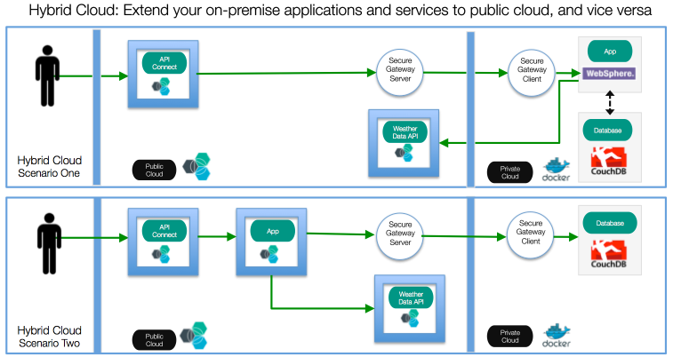
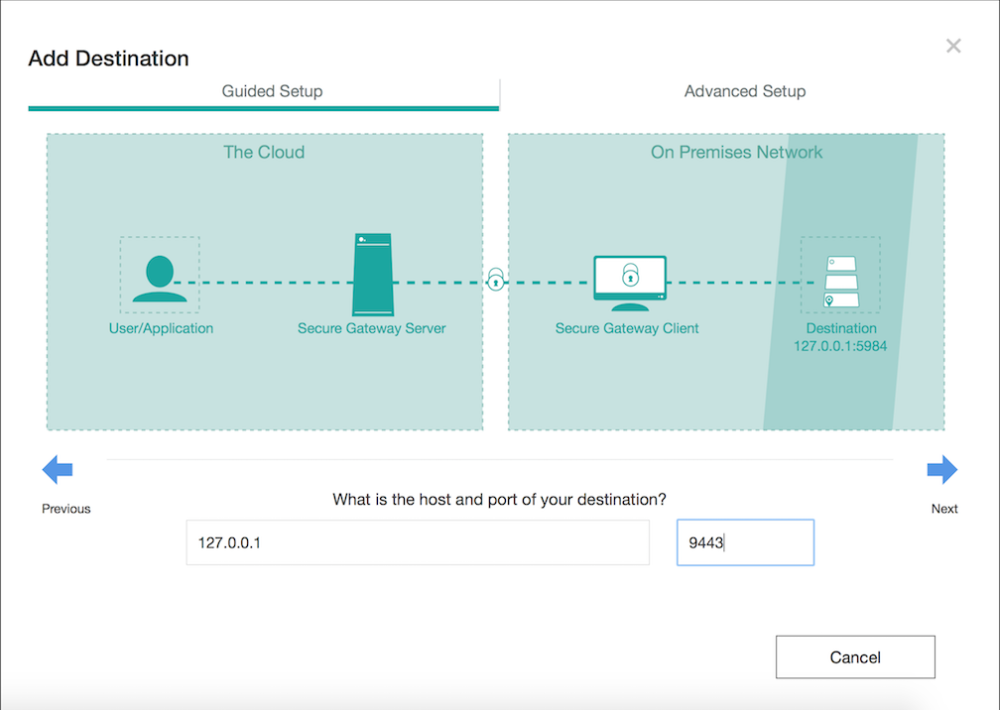
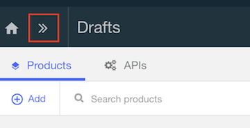
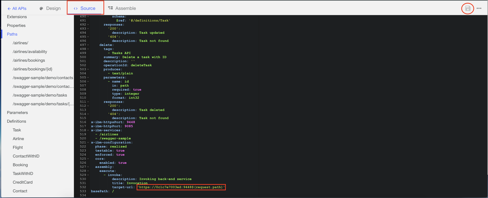

[](https://travis-ci.org/IBM/Hybrid-Cloud-Applications-and-Services) 

# Leve seus aplicativos e serviços de nuvem particular para a nuvem pública e vice-versa 
*Ler em outros idiomas: [한국어](README-ko.md).* 
Um modelo de nuvem híbrida combina elementos de nuvem particular e pública, oferecendo aos usuários a opção e a flexibilidade necessárias para executar aplicativos e serviços em sistemas locais e na nuvem. Nos termos mais simples, o modelo híbrido é, principalmente, uma nuvem particular que permite que uma organização utilize uma nuvem pública quando e onde faz sentido. 

Este código mostra como expor seus aplicativos e serviços locais na nuvem pública e vice-versa. Neste código, temos um aplicativo Java local que usa anotações de JAX-RS e Swagger, bem como banco de dados que usa CouchDB, ambos executados em uma nuvem particular atrás de um firewall. 
Para demonstrar como, utilizamos serviços de nuvem pública como Secure Gateway e API Connect. Podemos criar um túnel e expor o aplicativo de nuvem particular e as APIs fora do firewall corporativo. 

Indo além, movemos o aplicativo para uma nuvem pública e, em seguida, orientamos como seu aplicativo executado em nuvem pública pode acessar recursos locais, como banco de dados etc. 

## Cenários 
- [Cenário Um: Ativar seu aplicativo na nuvem particular para ser acessado externamente por meio da nuvem pública](#scenario-one-enable-your-application-in-private-cloud-to-be-accessed-externally-via-public-cloud) 
- [Cenário Dois: Ativar seu aplicativo na nuvem pública para se conectar a recursos na nuvem particular](#scenario-two-enable-your-application-in-public-cloud-to-connect-to-resources-in-private-cloud) 
 

## Componentes inclusos 
Os cenários são feitos usando: 
- [Cloud Foundry](https://www.cloudfoundry.org/) 
- [CouchDB](http://couchdb.apache.org) 
- [WebSphere Liberty](https://developer.ibm.com/wasdev/websphere-liberty/) 
- [API Connect](http://www-03.ibm.com/software/products/en/api-connect) 
- [Secure Gateway](https://console.ng.bluemix.net/docs/services/SecureGateway/sg_overview.html) 
- [Insights for Weather](https://console.ng.bluemix.net/docs/services/Weather/weather_overview.html#about_weather) 

## Pré-requisitos
Como precisamos do [Maven](https://maven.apache.org/install.html) para desenvolver nosso aplicativo de amostra e do [Docker](https://www.docker.com/community-edition#/download) para executar o aplicativo e o banco de dados. 
Instale o [Maven](https://maven.apache.org/install.html) e o [Docker](https://www.docker.com/community-edition#/download) antes de avançar para as [etapas](#steps). Se preferir usar o [Vagrant](https://www.vagrantup.com/) para gerenciar ambientes temporários, um arquivo de desenvolvimento que cria uma VM Ubuntu com um JDK, um Maven e um Docker estará no diretório inicial do projeto. 
## Etapas 
### Conectar seu ambiente local à nuvem pública 
1. [Criar um túnel para conectar seu ambiente local à nuvem pública](#1-create-a-tunnel-to-connect-your-on-premise-environment-to-public-cloud) 
### Cenário Um: Ativar seu aplicativo na nuvem particular para ser acessado externamente por meio da nuvem pública 
2. [Desenvolver um aplicativo de amostra para ser executado no local e usar o banco de dados local](#2-build-sample-application-to-run-on-premise-and-use-on-premise-database) 
3. [Executar o aplicativo e o banco de dados locais usando WebSphere Liberty, CouchDB e Docker](#3-run-the-application-and-database-on-premise-using-websphere-liberty-couchdb-and-docker) 
### Cenário Dois: Ativar seu aplicativo na nuvem pública para se conectar a recursos na nuvem particular
4. [Desenvolver um aplicativo de amostra para ser executado na nuvem pública e usar um banco de dados local](#4-build-sample-application-to-run-on-public-cloud-and-use-on-premise-database) 
5. [Executar o aplicativo na nuvem pública usando Bluemix e o banco de dados local com CouchDB e Docker](#5-run-the-application-on-public-cloud-using-bluemix-and-database-on-premise-using-couchdb-and-docker) 
### Catalogar e publicar as APIs do aplicativo na nuvem pública usando API Connect 
6. [Criar um serviço de API Connect no Bluemix](#6-create-an-api-connect-service-in-bluemix) 
7. [Integrar WebSphere Liberty e API Connect: push e pull](#7-integrate-websphere-liberty-and-api-connect-push-and-pull) 
- 7.1 [Realizar o push das APIs do aplicativo em execução no WebSphere para API Connect](#71-push-websphere-liberty-apis-into-api-connect) 
- 7.2 [Realizar o pull das APIs do aplicativo no WebSphere Liberty do API Connect](#72-pull-websphere-liberty-apis-from-api-connect) 
[Resolução de Problemas](#troubleshooting) 
# 1. Criar um túnel para conectar seu ambiente local com a nuvem pública 
Nesta etapa, usaremos o serviço de Secure Gateway do Bluemix para criar um túnel do ambiente local até o host da nuvem pública. Nesta amostra, para manter a configuração simples, o protocolo TCP será usado. O produto Secure Gateway oferece outras opções de protocolo (UDP, HTTP, HTTPS, TLS/SSL) que podem oferecer opções de segurança e autenticação superiores para aplicativos que usam o serviço Secure Gateway. As soluções com aplicativos e dados de produção devem ser avaliadas com base no perfil de risco para selecionar o protocolo de acesso e o esquema de autenticação corretos para o Secure Gateway. Mais detalhes sobre as configurações do Secure Gateway estão disponíveis [aqui](https://console.ng.bluemix.net/docs/services/SecureGateway/sg_overview.html#sg_overview); um exemplo de configuração do TLS no lado do aplicativo e do cliente pode ser acessado [aqui](https://console.ng.bluemix.net/docs/services/SecureGateway/sg_023.html#sg_023). Indo além, estamos prosseguindo com o TCP para exibir o conceito.

1. Crie seu [serviço do Secure Gateway](https://console.ng.bluemix.net/catalog/services/secure-gateway?taxonomyNavigation=apis) no Bluemix. 
2. Depois, siga este tutorial [Introdução ao Secure Gateway](https://console.ng.bluemix.net/docs/services/SecureGateway/secure_gateway.html) para configurar seu gateway. 
3. Durante a configuração do cliente do Secure Gateway, instale o **IBM Installer** e execute-o na sua nuvem particular.  
4. Após abrir o cliente do Secure Gateway com o ID do gateway e o token de segurança, você precisará incluir entradas da lista de acesso no terminal local. 

Se estiver fazendo o [Cenário Um: Ativar seu aplicativo na nuvem particular para ser acessado externamente por meio da nuvem pública](#scenario-one-enable-your-application-in-private-cloud-to-be-accessed-externally-via-public-cloud), execute `acl allow 127.0.0.1:9443` no cliente do Secure Gateway para possibilitar o acesso ao servidor do aplicativo. 
Se estiver fazendo o [Cenário Dois: Ativar seu aplicativo na nuvem pública para se conectar a recursos na nuvem particular](#scenario-two-enable-your-application-in-public-cloud-to-connect-to-resources-in-private-cloud), execute `acl allow 127.0.0.1:5984` para possibilitar o acesso ao banco de dados. 

5. Retorne à página do Secure Gateway do Bluemix e crie seu destino. Em primeiro lugar, selecione **On-Premises** em Guided Setup e clique em Next.  
6. Em seguida, insira **127.0.0.1** para o nome do host do recurso e **9443**(Cenário Um) / **5984**(Cenário Dois) para a porta e clique em Next.  
7. Depois, selecione **TCP** para o protocolo e clique em Next. A seguir, selecione **None** para a autenticação e clique em Next. Não insira nada nas regras da tabela de IP. Por fim, nomeie o destino e clique em **Add Destination**. 
8. Para visualizar e anotar o host da nuvem, clique no **ícone da engrenagem** no destino Se estiver fazendo o [Cenário Um], continue ou pule para o [Cenário 2](#4-build-sample-application-to-run-on-public-cloud-and-use-on-premise-database). 

# 2. Desenvolver um aplicativo de amostra para ser executado no local e usar o banco de dados local 

Nosso aplicativo de API Airline é um aplicativo de reservas de passagens aéreas que demonstra como o aplicativo de API consegue armazenar dados usando um banco de dados local. Também incluiremos nossa própria credencial da API Weather do Bluemix público para o aplicativo e desenvolveremos um arquivo .war usando o Maven. A API Weather informará a condição meteorológica dos aeroportos de destino selecionados pelos clientes. 

1. Crie o [serviço de API Weather ](https://console.ng.bluemix.net/catalog/services/weather-company-data?taxonomyNavigation=data) no Bluemix. 
2. Acesse as **credenciais de serviço** da API Weather e anote seu nome de usuário e a senha. Depois, execute `cd flight-booking/src/main/java/microservices/api/sample` para acessar o diretório de amostra. Agora, inclua a credencial de nome do usuário e senha no arquivo **WeatherAPI.java**.  
3. Retorne para o diretório **flight-booking**, execute `mvn package` para desenvolver o arquivo .war. 
4. Agora, acesse o diretório **deployment_artifacts** e mova o arquivo **airlines.war** para a pasta **airline_app/apps** do diretório principal. 
# 3. Executar o aplicativo e o banco de dados locais usando WebSphere Liberty, CouchDB e Docker 
Neste exemplo, utilizaremos o WebSphere Liberty para o servidor do aplicativo e o CouchDB local para nosso banco de dados. Primeiramente, vamos desenvolver a imagem docker do servidor do aplicativo. No final desta etapa, você deve ser capaz de chamar as APIs do aplicativo por host local. 
1. Para implementar o aplicativo de API Airline, coloque o arquivo **.war** na pasta **airline_app/apps** e configure o arquivo **server.xml**. Para este exemplo, estamos usando o aplicativo de API Airline, mas você também pode incluir seu próprio aplicativo. No diretório principal, desenvolva seu servidor e execute-o no host local. ```bash
docker build -t hybrid/airlines . docker-compose up 
``` 

Os contêineres de banco de dados e do servidor do aplicativo serão iniciados; o terminal exibirá todos os logs do seu aplicativo. Depois que o servidor e o banco de dados estiverem em execução, abra outro terminal e execute os comandos a seguir para iniciar o couchDB. 
```bash 
bash database_init.sh 
``` 
2. Para chegar à interface com o usuário do WebSphere Liberty API Discovery, acesse `https://localhost:9443/ibm/api/explorer`. Aceite todos os avisos de certificado que vir a respeito de um certificado autoassinado. Utilize as credenciais do server.xml para efetuar login (Para este exemplo, o **nome do usuário** é `admin` e a **senha** é `admin`). Algo parecido com isto deve aparecer na interface com o usuário do API Discovery. 
 
3. Como mostrado na captura de tela a seguir, é possível clicar no botão **Try it out**, que inicia o aplicativo Airline executado no Docker  
4. Agora, acesse `https://<Cloud Host:Port>/ibm/api/explorer/` e verifique se a interface do servidor local pode ser acessada a partir do servidor de gateway do “host da nuvem” pública. Lembre-se: “host da nuvem” é a informação do servidor do Secure Gateway que anotamos no final da [Etapa 1](#1-create-a-tunnel-to-connect-your-on-premise-enviroment-to-public-cloud); o nome do usuário padrão é **admin** e a senha é **admin**. Como estamos utilizando o TCP neste exemplo, a capacidade de alcançar essa URL significa que qualquer sistema na Internet já pode se conectar ao aplicativo WebSphere Liberty caso saiba o nome do host da nuvem e da porta. Na produção, o TLS/SSL deve ser usado com [Autenticação Mútua](https://console.ng.bluemix.net/docs/services/SecureGateway/sg_023.html#sg_007) para maior segurança. Pule para a [Etapa 6](#6-create-an-api-connect-service-in-bluemix) para expor as APIs do aplicativo por meio do API Connect 
# 4. Desenvolver um aplicativo de amostra para ser executado na nuvem pública e usar o banco de dados local
Nosso aplicativo de API de amostra é um aplicativo de reservas de passagens aéreas que demonstra como o aplicativo de API consegue armazenar dados usando um banco de dados local, além de aprimorar os recursos da API usando o Data Analytic Service do Bluemix. Nesta etapa, incluiremos nossa própria credencial da API Weather para o aplicativo e desenvolveremos nosso arquivo .war usando o Maven. 
1. Crie o [serviço de API Weather](https://console.ng.bluemix.net/catalog/services/weather-company-data?taxonomyNavigation=data). A API Weather consegue informar a localização do aeroporto e a condição meteorológica para os clientes. 
2. Acesse as **credenciais de serviço** da API Weather e anote seu nome de usuário e a senha. Depois, execute `cd flight-booking/src/main/java/microservices/api/sample` para acessar o diretório de amostra. Agora, inclua a credencial de nome do usuário e senha no arquivo **WeatherAPI.java**. 

3. Além disso, é necessário alterar o endereço do banco de dados para *cloud host:port* no arquivo **DatabaseAccess.java**. 

4. Retorne para o diretório **flight-booking**, execute `mvn package` para desenvolver seu arquivo .war. 
5. Depois, acesse o diretório **deployment_artifacts** e mova o arquivo **airlines.war** para a pasta **airline_app/apps** do diretório principal. 

# 5. Execute o aplicativo na nuvem pública usando o Bluemix e o banco de dados local com CouchDB e Docker 1. 

Crie um banco de dados local usando o Docker. Execute os comandos a seguir para usar a imagem Docker do CouchDB da comunidade. 

```bash 
docker pull couchdb:latest docker run -p 5984:5984 couchdb 
``` 

Depois, inicie o CouchDB com este script. 

```bash
bash database_init.sh 
``` 

2. Agora, é possível retornar para o diretório principal e realizar o push do aplicativo para a nuvem. Para este exemplo, realizaremos o push do aplicativo para o IBM Cloud Foundry. Portanto, precisamos instalar a [CLI do Cloud Foundry](https://docs.cloudfoundry.org/cf-cli/install-go-cli.html). 
3. Use os comandos a seguir para efetuar login no Cloud Foundry e realizar o push do aplicativo para a nuvem. &gt;Observação: Substitua <app_name> por um nome do aplicativo exclusivo dentro da sua região do Bluemix. Esse nome do aplicativo é o nome do contêiner de API. 

```bash
cf login -a https://api.ng.bluemix.net cf push <app_name> -p airline_app 
```

3. Para chegar à interface com o usuário do API Discovery do aplicativo, acesse https://<app_name>.mybluemix.net/ibm/api/explorer. Em seguida, utilize as credenciais do server.xml para efetuar login (Para este exemplo, o **nome do usuário** é `admin` e a **senha** é `admin`). Algo parecido com isto deve aparecer na interface com o usuário do API Discovery. 

 

4. Como mostrado na captura de tela a seguir, é possível clicar no botão **Try it out**, que chama o aplicativo executado no Cloud Foundry com o banco de dados local. 


# 6. Criar um serviço API Connect no Bluemix

Nesta etapa, configuraremos o serviço API Connect para nos ajudar a expor as APIs do aplicativo para o público.
1. Para incluir o API Connect como serviço do Bluemix, acesse o [serviço API Connect](https://console.ng.bluemix.net/catalog/services/api-connect?taxonomyNavigation=services) do Bluemix 
2. A seguir, selecione **Essentials plan** e clique em **Create**. 
3. Para acessar o painel, clique aqui  
4. Por padrão, é criado um catálogo vazio chamado **Sandbox**. Para ativar o portal do desenvolvedor correspondente, clique em **Sandbox** e em **Settings**. 
5. Clique em **Portal**; em **Portal Configuration**, selecione **IBM Developer Portal**. Uma URL do portal será inserida automaticamente. 
6. Anote a URL do portal, que revela o endereço do servidor de destino e a organização dos quais você precisará mais tarde. A URL divide-se nas três partes a seguir, como mostra esta captura de tela: 
 
 - 1 é o nome curto do catálogo; no caso, sb. 
 - 2 é o ID da organização; no exemplo, arthurdmcaibmcom-dev. 
 - 3 é o endereço de destino da instância do API Connect; por exemplo, https://us.apiconnect.ibmcloud.com. 
7. Clique em Save, no canto superior direito. Será exibida esta mensagem: `Creating the developer portal for catalog ‘Sandbox’ may take a few minutes. You will receive an email when the portal is available.` 
8. Depois de receber o e-mail, acesse a **URL do portal** e você verá algo assim. 
 
É aqui que os desenvolvedores corporativos encontram os produtos (por exemplo, uma API ou um grupo de APIs) expostos no catálogo de APIs. Os desenvolvedores também podem interagir uns com os outros por meio dos links de Blogs e Fóruns. 
# 7. Integrar WebSphere Liberty e API Connect: push e pull &gt; 
Escolha entre realizar [push](#71-push-websphere-liberty-apis-into-api-connect) ou [pull](#72-pull-websphere-liberty-apis-from-api-connect) das APIs do WebSphere Liberty do API Connect. 
Observação: a integração por push não funcionará para usuários que têm IDs IBM federados corporativos para acessar o Bluemix no momento atual. 
## 7.1 Realizar o push das APIs do WebSphere Liberty para API Connect
Nesta etapa, aprenderemos a usar a solicitação de publicação no API Discovery para realizar o push das APIs para API Connect. 
1. Acesse `https://&lt;Cloud Host:Port/app_name&gt;/ibm/api/explorer/` 
2. Clique em **POST** para o terminal do API Connect  
3. Preencha os parâmetros como mostra a captura de tela a seguir; o ID da organização deve ser a segunda parte da URL do portal. 
 
4. A intenção é publicar este produto de API, não apenas prepará-lo; deixe o parâmetro stageOnly como falso. O parâmetro X-APIM-Authorization representa as credenciais usadas pelo Liberty para efetuar login no API Connect. A descrição no lado direito fornece detalhes a respeito do formato aceito. O exemplo a seguir usa: `apimanager/bluemixAccount@domain.com:myBluemixPassword`. 
 
5. Para o Cenário Dois, podemos clicar no arquivo JSON de amostra, à sua direita, e publicar suas APIs. Para o Cenário Um, como estamos executando as APIs na nuvem particular, não queremos usar o arquivo JSON de amostra porque isso definirá a URL de destino das APIs para a nuvem particular. Em vez disso, queremos mudar a parte `<cloud host:port>` na **target-url** (linha 38) do arquivo JSON a seguir (também é possível encontrar no arquivo **discovery-post.json**) para cloud host:port (por exemplo, `"https://cap-sg-prd-3.integration.ibmcloud.com:16218$(request.path)"`). Em seguida, copie e cole na caixa de entrada do corpo. 
```JSON 
{ 
    "product": "1.0.0", "info": { 
    "name": "pushed-product",
    "title": "A Product that encapsulates Liberty APIs",
    "version": "1.0.0"
}, 
"visibility": { 
    "view": { 
        "enabled": true, 
        "type": "public", 
        "tags": [ 
            "string" 
            ], 
        "orgs": [ 
            "string" 
        ] 
    }, 
    "subscribe": { 
        "enabled": true,
        "type": "authenticated",
        "tags": [ 
                "string"
        ], 
        "orgs": [ 
            "string" 
        ] 
    } 
},
"apis": { 
    "liberty": { 
        "name": "liberty-api:1.0.0", 
        "x-ibm-configuration": { 
            "assembly": { 
                "execute": [ 
                    { "invoke": { 
                        "target-url": "<cloud host:port>$(request.path)", 
                        "title": "Invocation" 
                        } 
                    } 
                ] 
            } 
        } 
    } 
}, 
"plans": { 
    "default": { 
        "title": "Default Plan", 
        "rate-limit": { 
            "value": "100/hour", 
            "hard-limit": false 
        }, 
        "approval": false 
    } 
}, 
"createdAt": "2017-05-01T16:13:05.912Z", 
"createdBy": "string" } 
``` 
 

6. Agora, você está pronto para publicar essas APIs. Clique em **Try it out!**  
7. Em menos de um minuto, você deve ver a operação ser retornada com êxito (código 200), com o conteúdo da resposta, o código e os cabeçalhos exibidos, como mostra a captura de tela a seguir:  Parabéns. Sua API foi publicada. Agora, você pode explorar o API Connect Developer Portal assim como fariam os consumidores da sua API. Acesse a **URL do portal** e clique em **API Products**. Selecione o produto de API e teste-o por meio do API Connect Developer Portal. Clique em qualquer chamada da API e teste-a usando o botão **call operation**. 

 

## 7.2 Realizar o pull de APIs do WebSphere Liberty do API Connect 

Nesta etapa, aprenderemos a criar e gerenciar novas APIs e produtos no API Connect usando a interface com o usuário do API Connect. 

1. No painel principal do API Connect no Bluemix, clique no ícone do menu e selecione **Drafts**. Clique em **APIs**, clique em **Add** e selecione **Import API from a file or URL**.  
2. Na janela **Import API from a file or URL**, clique em **Or import from URL**. Para a URL, digite a URL do Liberty que deseja usar para importar o documento do Swagger. Para este exemplo, utilize `https://&lt;Cloud Host:Port/app_name&gt;/ibm/api/docs/apiconnect`. Como antes, neste exemplo, o nome do usuário é **admin** e a senha é **admin**. 
3. Para o Cenário Dois, você não precisa fazer nada. Para o Cenário Um, como nossas APIs estão hospedadas na nuvem particular, precisamos definir a URL de destino das APIs para o host da nuvem. Portanto, depois de importar sua API, acesse **source**. Depois, vá para a parte inferior da página (em torno da linha 532) e altere o valor da **target-url** para `'<cloud host:port>$(request.path)'` (replace `<cloud host:port>` para sua própria cloud host:port). Em seguida, clique no **ícone de salvar** no canto superior direito.  
4. Clique em **All APIs** para retornar para a página principal Drafts. Clique em **Products** e em **Add &gt; New Product**. Na janela Add a new product, digite um título (pode ser qualquer coisa) e clique em **Add**. 
5. A visualização do design é aberta para o produto. Role para baixo até a seção das APIs e clique no ícone +.  
6. Selecione a API que acabou de importar e clique em **Apply**. 
7. Na seção de planos, é possível criar planos diferentes com limites de taxas diferentes para controlar quais métodos de cada API serão expostos. Para este exemplo, utilize o plano padrão. Clique no **ícone de salvar** para salvar suas alterações. 
8. Agora, você está pronto para preparar seu produto em um catálogo. Clique no **ícone de nuvem** e selecione o catálogo na qual deseja preparar as APIs. 
9. Para retornar ao catálogo, clique no ícone do menu e selecione **Dashboard**. Depois, clique no ícone do menu para o produto preparado e selecione **Publish**.  
10. Na nova janela que será aberta, será possível editar quem poderá visualizar suas APIs e quem poderá assinar seus planos de API. Para este exemplo, utilize os padrões e clique em **Publish**. Parabéns. Sua API foi publicada. Agora, você pode explorar o API Connect Developer Portal assim como fariam os consumidores da sua API. Acesse a **URL do portal** e clique em **API Products**. Selecione o produto de API e teste-o por meio do API Connect Developer Portal. Clique em qualquer chamada da API e teste-a usando o botão **call operation**.  

# Resolução de Problemas 
Para interromper os serviços de composição do Docker, neste diretório principal, execute 
```bash
docker-compose down 
``` 
Para remover o contêiner do Docker, execute 
```bash 
docker ps --all docker kill <container ID> #run this command if your container is still running docker rm <container ID>
``` 
Para remover os serviços Insights for Weather, API Connect e Secure Gateway, acesse o painel do IBM Bluemix. Em seguida, clique no **ícone do menu** e selecione **Delete Service**. 

# Referências 
Este exemplo do WebSphere API Connect baseia-se neste [artigo](https://www.ibm.com/developerworks/library/mw-1609-demagalhaes-bluemix-trs/1609-demagalhaes.html) do developerWorks. 

# Licença 
[Apache 2.0](LICENÇA) 